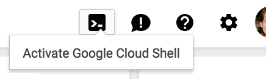
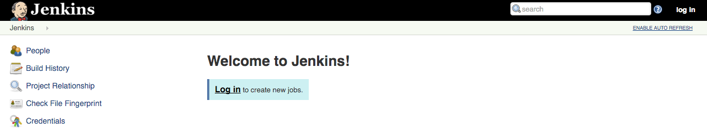

# Lab: Build a Continuous Deployment Pipeline with Jenkins and Kubernetes

For a more in depth best practices guide, go to the solution posted [here](https://cloud.google.com/solutions/jenkins-on-container-engine).

## Introduction

This guide will take you through the steps necessary to continuously deliver
your software to end users by leveraging [Google Container Engine](https://cloud.google.com/container-engine/)
and [Jenkins](https://jenkins.io) to orchestrate the software delivery pipeline.
If you are not familiar with basic Kubernetes concepts, have a look at
[Kubernetes 101](http://kubernetes.io/docs/user-guide/walkthrough/).

In order to accomplish this goal you will use the following Jenkins plugins:
  - [Jenkins Kubernetes Plugin](https://wiki.jenkins-ci.org/display/JENKINS/Kubernetes+Plugin) - start Jenkins build executor containers in the Kubernetes cluster when builds are requested, terminate those containers when builds complete, freeing resources up for the rest of the cluster
  - [Jenkins Pipelines](https://jenkins.io/solutions/pipeline/) - define our build pipeline declaratively and keep it checked into source code management alongside our application code
  - [Google Oauth Plugin](https://wiki.jenkins-ci.org/display/JENKINS/Google+OAuth+Plugin) - allows you to add your google oauth credentials to jenkins

In order to deploy the application with [Kubernetes](http://kubernetes.io/) you will use the following resources:
  - [Deployments](http://kubernetes.io/docs/user-guide/deployments/) - replicates our application across our kubernetes nodes and allows us to do a controlled rolling update of our software across the fleet of application instances
  - [Services](http://kubernetes.io/docs/user-guide/services/) - load balancing and service discovery for our internal services
  - [Ingress](http://kubernetes.io/docs/user-guide/ingress/) - external load balancing and SSL termination for our external service
  - [Secrets](http://kubernetes.io/docs/user-guide/secrets/) - secure storage of non public configuration information, SSL certs specifically in our case

## Prerequisites

1. A Google Cloud Platform Account
1. [Enable the Compute Engine, Container Engine, and Container Builder APIs](https://console.cloud.google.com/flows/enableapi?apiid=compute_component,container,cloudbuild.googleapis.com)

## Do this first

In this section you will start your [Google Cloud Shell](https://cloud.google.com/cloud-shell/docs/)
and clone the lab code repository to it.

1. Create a new Google Cloud Platform project: [https://console.developers.google.com/project](https://console.developers.google.com/project)

1. Click the Activate Cloud Shell icon in the top-right and wait for your shell to open.

   

   > If you are prompted with a _Learn more_ message, click __Continue__ to
   > finish opening the Cloud Shell.

1. When the shell is open, use the [gcloud](https://cloud.google.com/sdk/)
   command line interface tool to set your default compute zone:

   

   ```shell
   gcloud config set compute/zone us-east1-d
   ```

   Output (do not copy):

   ```output
   Updated property [compute/zone].
   ```

1. Set an environment variable with your project:

   ```shell
   export GOOGLE_CLOUD_PROJECT=$(gcloud config get-value project)
   ```

   Output (do not copy):

   ```output
   Your active configuration is: [cloudshell-...]
   ```
   
   ```shell
   export GKE_VERSION=1.24
   ```
   
   (note) The GKE version should be updated when you have error creating the
   Kubernetes Cluster for Jenkins.


1. Clone the lab repository in your cloud shell, then `cd` into that dir:

   ```shell
   git clone https://github.com/GoogleCloudPlatform/continuous-deployment-on-kubernetes.git
   ```

   Output (do not copy):

   ```output
   Cloning into 'continuous-deployment-on-kubernetes'...
   ...
   ```

   ```shell
   cd continuous-deployment-on-kubernetes
   ```

## Change GCP organization policy enforcements

1. Read the details from the oficial document provided from Google

    Reference: https://cloud.google.com/load-balancing/docs/org-policy-constraints. <br/>
    It is strongly recommended to enforce this Organization Policy so the Global Load Balancer creation is restricted/controlled. For the sake of the demo, we will disable the constraints/compute.restrictLoadBalancerCreationForTypes, but please follow the guidance on how to manage the creation of the Global Load Balancer appropriatly.
    
2. Disable Organization Policy (Disable global load balancing) for the target project 

<!---
  ```shell
    gcloud resource-manager org-policies disable-enforce \
      --project $GOOGLE_CLOUD_PROJECT \
      constraints/compute.disableGlobalLoadBalancing
   ```
   
   (note) This command will disable the Organization Policy enforcement of the target project only.
   
   Output (do not copy)
   
   ```output
   booleanPolicy: {}
   constraint: constraints/compute.disableGlobalLoadBalancing
   etag: CMaonqEGEIjYi2Y=
   updateTime: '2023-04-01T02:17:42.214101Z'
   ```
   
3. Allow Protocol Forwarding Based on type of IP Address
--->
   ```shell
    gcloud resource-manager org-policies set-policy  \
    --project=$GOOGLE_CLOUD_PROJECT ./jenkins/orgpolicy.json
   ```

## Create a Service Account with permissions

1. Create a service account, on Google Cloud Platform (GCP).

   Create a new service account because it's the recommended way to avoid
   using extra permissions in Jenkins and the cluster.

   ```shell
   gcloud iam service-accounts create jenkins-sa \
       --display-name "jenkins-sa"
   ```

   Output (do not copy):

   ```output
   Created service account [jenkins-sa].
   ```

1. Add required permissions, to the service account, using predefined roles.

   Most of these permissions are related to Jenkins use of _Cloud Build_, and
   storing/retrieving build artifacts in _Cloud Storage_. Also, the
   service account needs to enable the Jenkins agent to read from a repo
   you will create in _Cloud Source Repositories (CSR)_.

   ```shell
   gcloud projects add-iam-policy-binding $GOOGLE_CLOUD_PROJECT \
       --member "serviceAccount:jenkins-sa@$GOOGLE_CLOUD_PROJECT.iam.gserviceaccount.com" \
       --role "roles/viewer"

   gcloud projects add-iam-policy-binding $GOOGLE_CLOUD_PROJECT \
       --member "serviceAccount:jenkins-sa@$GOOGLE_CLOUD_PROJECT.iam.gserviceaccount.com" \
       --role "roles/source.reader"

   gcloud projects add-iam-policy-binding $GOOGLE_CLOUD_PROJECT \
       --member "serviceAccount:jenkins-sa@$GOOGLE_CLOUD_PROJECT.iam.gserviceaccount.com" \
       --role "roles/storage.admin"

   gcloud projects add-iam-policy-binding $GOOGLE_CLOUD_PROJECT \
       --member "serviceAccount:jenkins-sa@$GOOGLE_CLOUD_PROJECT.iam.gserviceaccount.com" \
       --role "roles/storage.objectAdmin"

   gcloud projects add-iam-policy-binding $GOOGLE_CLOUD_PROJECT \
       --member "serviceAccount:jenkins-sa@$GOOGLE_CLOUD_PROJECT.iam.gserviceaccount.com" \
       --role "roles/cloudbuild.builds.editor"

   gcloud projects add-iam-policy-binding $GOOGLE_CLOUD_PROJECT \
       --member "serviceAccount:jenkins-sa@$GOOGLE_CLOUD_PROJECT.iam.gserviceaccount.com" \
       --role "roles/container.developer"
   ```

   You can check the permissions added using __IAM & admin__ in Cloud Console.

   

1. Export the service account credentials to a JSON key file in Cloud Shell:

   ```shell
   gcloud iam service-accounts keys create ~/jenkins-sa-key.json \
       --iam-account "jenkins-sa@$GOOGLE_CLOUD_PROJECT.iam.gserviceaccount.com"
   ```

   Output (do not copy):

   ```output
   created key [...] of type [json] as [/home/.../jenkins-sa-key.json] for [jenkins-sa@myproject.aiam.gserviceaccount.com]
   ```

1. Download the JSON key file to your local machine.

   Click __Download File__ from __More__ on the Cloud Shell toolbar:

   

1. Enter the __File path__ as `jenkins-sa-key.json` and click __Download__.

   The file will be downloaded to your local machine, for use later.

## Create a Kubernetes Cluster

1. Provision the cluster with `gcloud`:

   Use Google Kubernetes Engine (GKE) to create and manage your Kubernetes
   cluster, named `jenkins-cd`. Use the _service account_ created earlier.

   ```shell
   gcloud container clusters create jenkins-cd \
     --num-nodes 2 \
     --machine-type n1-standard-2 \
     --cluster-version $GKE_VERSION \
     --service-account "jenkins-sa@$GOOGLE_CLOUD_PROJECT.iam.gserviceaccount.com"
   ```

   Output (do not copy):

   ```output
   NAME        LOCATION    MASTER_VERSION  MASTER_IP     MACHINE_TYPE  NODE_VERSION   NUM_NODES  STATUS
   jenkins-cd  us-east1-d  1.15.11-gke.15   35.229.29.69  n1-standard-2 1.15.11-gke.15  2          RUNNING
   ```

1. Once that operation completes, retrieve the credentials for your cluster.

   ```shell
   gcloud container clusters get-credentials jenkins-cd
   ```

   Output (do not copy):

   ```output
   Fetching cluster endpoint and auth data.
   kubeconfig entry generated for jenkins-cd.
   ```

1. Confirm that the cluster is running and `kubectl` is working by listing pods:

   ```shell
   kubectl get pods
   ```

   Output (do not copy):

   ```output
   No resources found.
   ```

   > You would see an error if the cluster was not created, or you did not
   > have permissions.

1. Add yourself as a cluster administrator in the cluster's RBAC so that you can
   give Jenkins permissions in the cluster:

    ```shell
    kubectl create clusterrolebinding cluster-admin-binding --clusterrole=cluster-admin --user=$(gcloud config get-value account)
    ```

    Output (do not copy):

    ```output
    Your active configuration is: [cloudshell-...]
    clusterrolebinding.rbac.authorization.k8s.io/cluster-admin-binding created
    ```

## Install Helm

In this lab, you will use Helm to install Jenkins with a stable _chart_.  Helm
is a package manager that makes it easy to configure and deploy Kubernetes
applications.  Once you have Jenkins installed, you'll be able to set up your
CI/CD pipleline.

1. Download and install the helm binary

    ```shell
    wget https://get.helm.sh/helm-v3.2.1-linux-amd64.tar.gz
    ```

1. Unzip the file to your local system:

    ```shell
    tar zxfv helm-v3.2.1-linux-amd64.tar.gz
    cp linux-amd64/helm .
    ```

1. Add the official stable repository.

  <!---
  Alternative:
  https://artifacthub.io/packages/helm/jenkinsci/jenkins

  ```shell
    ./helm repo add stable https://kubernetes-charts.storage.googleapis.com
    ```

    ```shell
    ./helm repo rm stable
    ./helm repo add stable https://charts.helm.sh/stable
    ```
  --->

  Alternative:
  https://artifacthub.io/packages/helm/jenkinsci/jenkins

    ```shell
    ./helm repo add jenkins https://charts.jenkins.io
    ./helm repo update
    ```

  NOTES: For the user and password, please check the output of the installation
  of the Jenkins.


1. Ensure Helm is properly installed by running the following command. You
   should see version `v3.2.1` appear:

    ```shell
    ./helm version
    ```

    Output (do not copy):

    ```output
    version.BuildInfo{Version:"v3.2.1", GitCommit:"fe51cd1e31e6a202cba7dead9552a6d418ded79a", GitTreeState:"clean", GoVersion:"go1.13.10"}
    ```

## Configure and Install Jenkins

You will use a custom [values file](https://github.com/helm/charts/blob/master/stable/jenkins/values.yaml)
to add the GCP specific plugin necessary to use service account credentials to reach your Cloud Source Repository.

1. Use the Helm CLI to deploy the chart with your configuration set.

    Alternative:
    https://artifacthub.io/packages/helm/jenkinsci/jenkins

    ```shell
    ./helm install cd-jenkins jenkins/jenkins -f ./jenkins/values.yaml
    ```

    ```shell
    kubectl expose svc/cd-jenkins --port=8080 --protocol=TCP --name=jenkins --type=LoadBalancer
    ```

    (note) Expose jenkins UI to external by creating the LoadBalancer

1. The Jenkins pod __STATUS__ should change to `Running` when it's ready:

    ```shell
    kubectl get pods
    ```

    Output (do not copy):

    ```output
    NAME                          READY     STATUS    RESTARTS   AGE
    cd-jenkins-7c786475dd-vbhg4   1/1       Running   0          1m
    ```

1. Configure the Jenkins service account to be able to deploy to the cluster.

    ```shell
    kubectl create clusterrolebinding jenkins-deploy --clusterrole=cluster-admin --serviceaccount=default:cd-jenkins
    ```

    Output (do not copy):

    ```output
    clusterrolebinding.rbac.authorization.k8s.io/jenkins-deploy created
    ```

1. Set up port forwarding to the Jenkins UI, from Cloud Shell:

    ```shell
    export JENKINS_POD_NAME=$(kubectl get pods -l "app.kubernetes.io/component=jenkins-master" -o jsonpath="{.items[0].metadata.name}")
    kubectl port-forward $JENKINS_POD_NAME 8080:8080 >> /dev/null &
    ```

1. Now, check that the Jenkins Service was created properly:

    ```shell
    kubectl get svc
    ```

    Output (do not copy):

    ```output
    NAME               CLUSTER-IP     EXTERNAL-IP   PORT(S)     AGE
    cd-jenkins         10.35.249.67   <none>        8080/TCP    3h
    cd-jenkins-agent   10.35.248.1    <none>        50000/TCP   3h
    kubernetes         10.35.240.1    <none>        443/TCP     9h
    ```

    This Jenkins configuration is using the [Kubernetes Plugin](https://wiki.jenkins-ci.org/display/JENKINS/Kubernetes+Plugin),
    so that builder nodes will be automatically launched as necessary when the
    Jenkins master requests them.  Upon completion of the work, the builder nodes
    will be automatically turned down, and their resources added back to the
    cluster's resource pool.

    Notice that this service exposes ports `8080` and `50000` for any pods that
    match the `selector`. This will expose the Jenkins web UI and builder/agent
    registration ports within the Kubernetes cluster.  Additionally the `jenkins-ui`
    services is exposed using a ClusterIP so that it is not accessible from outside
    the cluster.

## Connect to Jenkins

1. The Jenkins chart will automatically create an admin password for you. To
   retrieve it, run:

    ```shell
    printf $(kubectl get secret cd-jenkins -o jsonpath="{.data.jenkins-admin-password}" | base64 --decode);echo
    ```

2. To get to the Jenkins user interface, click on the Web Preview
   button in cloud shell, then click
   **Preview on port 8080**:


You should now be able to log in with username `admin` and your auto generated
password.



### Your progress, and what's next

You've got a Kubernetes cluster managed by GKE. You've deployed:

* a Jenkins Deployment
* a (non-public) service that exposes Jenkins to its agent containers

You have the tools to build a continuous deployment pipeline. Now you need a
sample app to deploy continuously.

